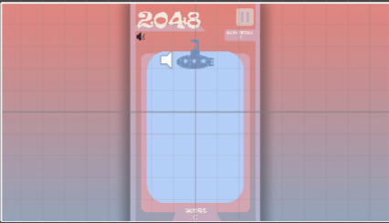

# 2048开发日志

# 1. 项目基本信息

项目负责人：买烤麸烤饼
主程序：买烤麸烤饼
美工：买烤麸烤饼
音效：洛一
配音：小鸠
项目开发周期：2021.6.25-2021.7.4

# 2. 开发分析

## 2.1 玩法分析

### 2.1.1 经典模式

开始时棋盘内随机出现两个数字
出现的数字仅可能为2或4。

玩家可以选择上下左右四个方向
若棋盘内的数字出现位移或合并，视为有效移动。

玩家选择的方向上若有相同的数字则合并
每次有效移动可以同时合并，但不可以连续合并。

合并所得的所有新生成数字想加即为该步的有效得分。

玩家选择的方向行或列前方有空格则出现位移。

每有效移动一步，棋盘的空位(无数字处)随机出现一个数字(依然可能为2或4)。

棋盘被数字填满，无法进行有效移动，判负，游戏结束。

棋盘上出现2048，判胜，游戏结束。

### 2.1.2 球球模式

随机生成2，4，8的球，掉落至水池中
遇到相同数字的球则合并

玩家可以在水池上方控制潜水艇的左右位置决定新生成球的位置

当水池被填满时游戏结束

# 3. UI设计

## 3.1 主页面UI

### 3.1.1开始页面

### 3.1.2 模式选择页面

## 3.2 游戏页面

### 3.2.1 经典模式页面

### 3.2.2 球球模式页面

### 3.2.3 暂停页面

### 3.2.4 失败页面

# 4. 程序设计

## 4.1 主场景(HomePageScene)

### 4.1.1 实体类图设计

### 4.1.2 场景活动图

### 4.1.3 View视图类

该场景为游戏开始时的主场景，用于玩家选择模式，加载游戏，查看游戏介绍等功能的实现。
在该场景下有一个主画布，该主画布下有3个功能面板，详细情况如下：

- HomePanel
  主面板
  是游戏的入口界面
- AboutPanel
  关于面板
  是游戏的介绍界面
- ModeChosePanel
  模式选择面板
  用于选择开始与加载的游戏模式

该场景的所有视图对象(UI)由**HomePageUIManager**类控制，它作为组件挂载在主画布**Canvas**上，其中包含了各个面板的全部按键响应函数。

### 4.1.4 Controller控制类

**PlayerSetting**类是该场景的唯一控制类，该类用于记录用户两种游戏设置：

- bool Mute
  游戏是否静音
- bool IsLoad
  是否加载之前保存的游戏进度

该类的脚本挂载至一个名叫**PlayerSetting**的空物体上，并设置为**DontDestroyOnLoad**(切换场景时不销毁该GO)。它会传递到下一个场景，即游戏场景，来决定是否加载之前保存的游戏进度。

## 4.2 经典模式场景(GameScene1)

### 4.2.1 实体类图设计

### 4.2.2 场景活动图

### 4.2.3 View视图类

该场景为经典模式游戏的场景，用于玩家游玩经典模式的2048小游戏。
在该场景下有三个画布，详细情况如下：

- GameCanvas
  游戏画布
  是进行游戏的界面
- PauseCanvas
  暂停画布
  是游戏暂停时的功能性画布
- GGCanvas
  游戏失败画布
  是游戏失败后弹出的画布

该场景的所有视图对象(UI)由**GamePageUIManager**类控制，它作为组件挂载在EventSystem上，其中包含了各个画布的全部按键响应函数。

值得注意的是，因为UI与游戏物体高度融合，Map应当显示在UI背景的前方。因此画布应当设置为**Screen Space-Camera渲染模式**。相关知识详见[UGUI详解-画布](https://mycroftcooper.github.io/2021/06/15/Unity-UGUI-%E7%94%BB%E5%B8%83/)

### 4.2.4 Controller控制类

### 4.2.5 Model模型类

### 4.2.6 核心算法摘要

#### 4.2.6.1 用户输入

#### 4.2.6.1 2048核心玩法算法

#### 4.2.6.2 数字块移动算法

## 4.3 球球模式场景(GameScene2)

### 4.3.1 实体类图设计

### 4.3.2 场景活动图

同3.2.2，略

### 4.3.3 View视图类

同3.2.3，略

### 4.3.4 Controller控制类

### 4.3.5 Model模型类

### 4.2.6 核心算法摘要

#### 4.2.6.1 用户输入

#### 4.2.6.2 数字球的生成与合并

# 5. 配音

## 5.1 配音内容

| 用于     | 内容                    | 描述                   |
| -------- | ----------------------- | ---------------------- |
| 游戏开始 | Game Start！            | 日式大佐英语，元气语气 |
| 游戏开始 | 游戏开始了哦！          | 中文，认真系美少女语气 |
| 游戏结束 | Game Over...            | 日式大佐英语，惋惜语气 |
| 游戏结束 | 失敗しました(失败啦...) | 日语，无口少女棒读     |
| 新纪录   | New Score！             | 日式大佐英语，元气语气 |

配音员：小鸠
